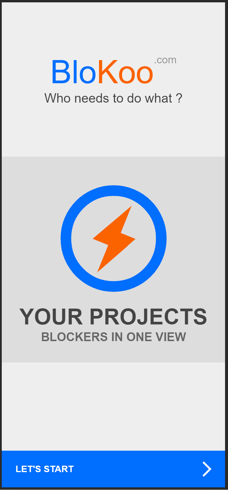
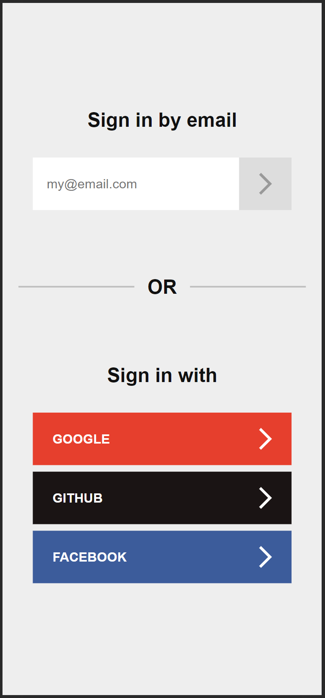
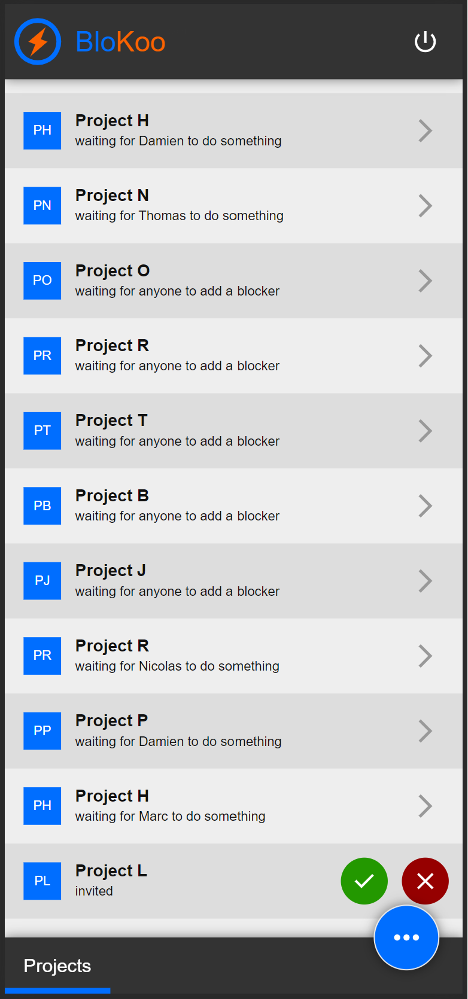
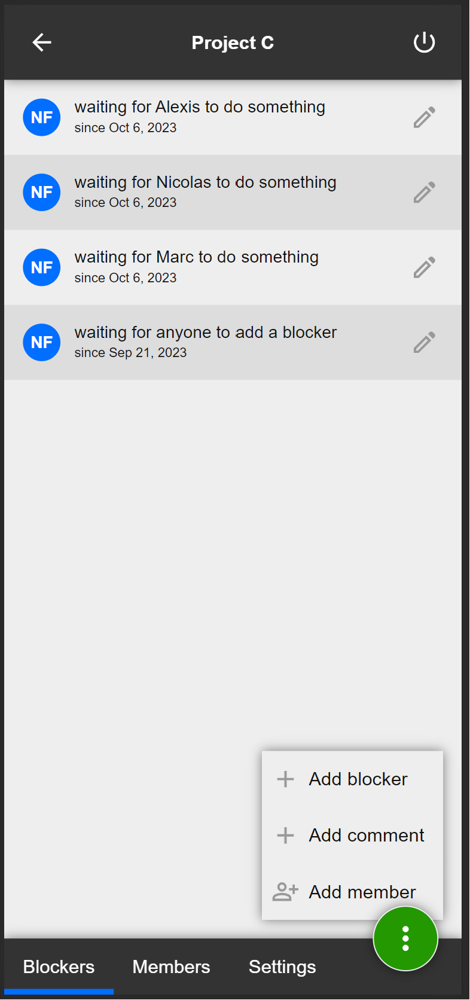

# BloKoo
Work in progress project using Angular 16's signals & type oriented architecture.

### Screenshots
| Homepage  | Authentication                          | Projects                                | Project                                 |
| ------------- |-----------------------------------------|-----------------------------------------|-----------------------------------------|
|  |  |  |  |

### Setup
```
npm install
```

### Development mode
```
npm start
```

### Production bundle
```
npm run build
```

# TODO List
- [ ] Implement remaining features
- [ ] Hunt for `TODO[nico]`
- [ ] Implement tests
- [ ] Setup firebase hosting
- [ ] Setup DNS blokoo.com
- [ ] Deploy, test, relax
